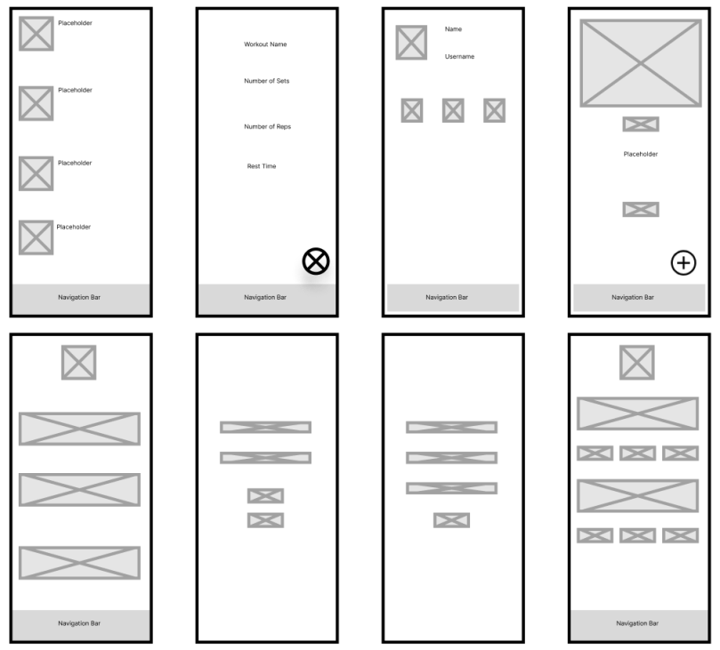
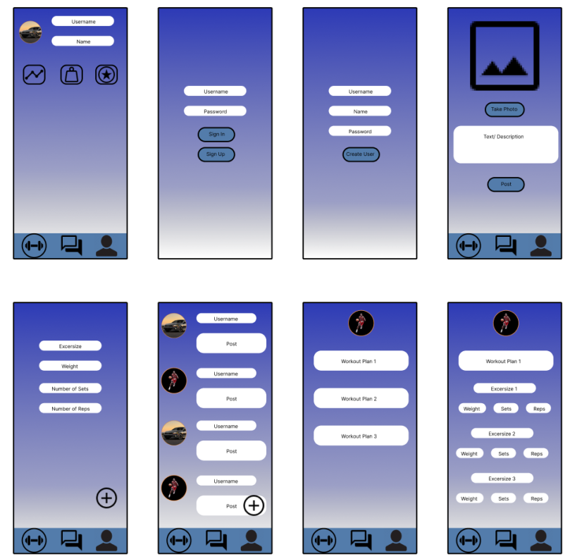
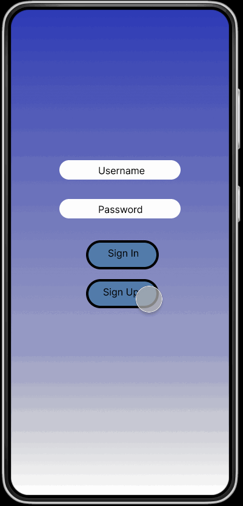
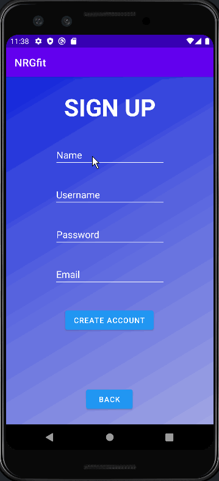
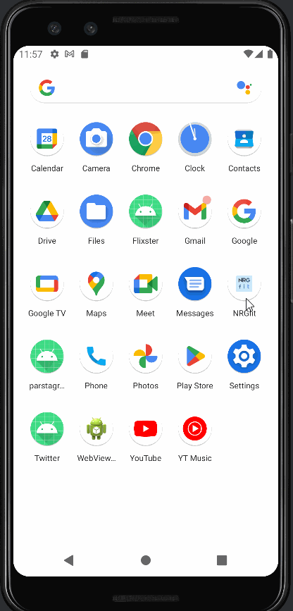

# BetaWorkout

Description

Workout app that allow for you to plan sessions and view other people's sessions in a fourm like manner. Potentially allow people to discuss and talk on the forum stye app to talk about form, workouts, etc.

App Evaluation

Category: Workout/ Social Forum

Mobile: When at the gym using a computer is out of the question and using the web may not be efficient. This makes our app fully intended for mobile use. Granted if you want to use it on the web, then it's possible, but for efficient use in the gym the app is best.

Story: Create workout plans that people can make private or public. Connect with other users for advice or their own workouts or publiclly made workouts. 

Market: Any individual that is an avid Gym member.

Habit: Should aim to be used whenever someone goes to the gym unless it's for a minimal workout or not desired.

Scope: First, get users to create their work out plan and determine wether they want to post it or not. Hopefully include the possiblity of a calendar that tracks what the user did on each day. Could work in tandem with apps that watch calorie intake.

Product Spec

1. User Stories (Required and Optional)

   Required Must-have Stories

* User logs in to access previous chats and preference settings.
* User creates workout plan.
* View table for workout plans that are made public.
* Profile pages for each user.
* Forum/ Feed where users can discuss.

   Optional Nice-to-have Stories

* Daily Streak keeping track of how often the user worksout
* Track the weights of exercises performed
* Visual Representation of a workout
* Time tracked of workouts per day

2. Screen Archetypes
* Login
   * Register - User signs up or logs into their account
   * User can reopen the app logged in if they don't sign out before closing the app
* Workout Create - Chat for users to communicate (direct 1-on-1)
   * Upon selecting music choice users matched and message screen opens
* Profile Screen
   * Users can choose thie profile picture and fill in other details
   * View saved workouts (personal or public)
* Feed
   * Forum like feed for other gym goers to discuss gym topics
* Bar Graph (Time)
   * Weekly graph depicting time spent in gym on a daily basis
   * Similar to "Screen Time" feature on iPhone
* Calendar
   * Keep track of how many times user went to the gym
* Workout Selection
   * User has the option of selecting from the Most Popular, Most Liked, and Most Viewed workouts, while also adding them into the Favorites tab
* Bar Graph (Weight)
   * Bar graph that tracks the weight for certain excersises 
  

3. Navigation
   Tab Navigation (Tab to Screen)

   * Workout Create
   * Profile
   * Feed
   * Optional:
      * Video Demonstration of Workout

   Flow Navigation (Screen to Screen)

      * Forced Log-in (ONLY IF NOT PREVIOUSLY SIGNED IN) -> Account creation if no log in is available
      * Workout Creation -> Jumps to Profile to View other Workout Plans
      * Profile -> Text field to be modified.
     
 Wireframes
 

Prototype
 

Schema
-------------------
* Login Screen

| Property | Type | Description |
| --- | --- | --- |
| objectId | String | unique id for the user post (default field) |
| Username | String | Username for the logging in user |
| Password | String | Password for the logging in user |
| createdAt | DateTime | date when post is created (default field) |
| updatedAt | DateTime | date when post is last updated (default field) |

* Create Account Screen

| Property | Type | Description |
| --- | --- | --- |
| objectId | String | unique id for the user post (default field) |
| Username | String | Username for the logging in user |
| Email | String | User has teh choice to add their email for furthere protection |
| Password | String | Password for the logging in user |
| createdAt | DateTime | date when post is created (default field) |
| updatedAt | DateTime | date when post is last updated (default field) |

* Forum Feed Screen

| Property | Type | Description |
| --- | --- | --- |
| objectId | String | unique id for the user post (default field) |
| Post | String | Description or content the user is posting about |
| Profile Picture | File | Proflie picture of the corresponding users post |
| createdAt | DateTime | date when post is created (default field) |
| updatedAt | DateTime | date when post is last updated (default field) |

* Routines Screen

| Property | Type | Description |
| --- | --- | --- |
| objectId | String | unique id for the user post (default field) |
| Profile Picture | File | Proflie picture of the corresponding users post |
| Workout Plan Name | String | Name of the Routine that the user wants to do |
| createdAt | DateTime | date when post is created (default field) |
| updatedAt | DateTime | date when post is last updated (default field) |

* Create Routine Screen

| Property | Type | Description |
| --- | --- | --- |
| objectId | String | unique id for the user post (default field) |
| Routine Name | String | Name of the routine the user wants to change |
| Excersize | String | Name of the individual excersize the user wants to do |
| Weight | Number | Weight for the specific excersize |
| Sets | Number | Number of sets the user wants to do for the excersize |
| Reps | Number | Number of reps the user wants to do per set |
| createdAt | DateTime | date when post is created (default field) |
| updatedAt | DateTime | date when post is last updated (default field) |

* Show Routine Screen

| Property | Type | Description |
| --- | --- | --- |
| objectId | String | unique id for the user post (default field) |
| Profile Picture | File | Proflie picture of the corresponding users post |
| Workout Plan Name | String | Name of the Routine that the user wants to do |
| Excersize | String | Name of the individual excersize the user wants to do |
| Weight | Number | Weight for the specific excersize |
| Sets | Number | Number of sets the user wants to do for the excersize |
| Reps | Number | Number of reps the user wants to do per set |
| createdAt | DateTime | date when post is created (default field) |
| updatedAt | DateTime | date when post is last updated (default field) |

* Post Screen

| Property | Type | Description |
| --- | --- | --- |
| objectId | String | unique id for the user post (default field) |
| Picture | File | Picture of the corresponding users post |
| Post | String | Description or content the user is posting about |
| createdAt | DateTime | date when post is created (default field) |
| updatedAt | DateTime | date when post is last updated (default field) |

* Profile Screen

| Property | Type | Description |
| --- | --- | --- |
| objectId | String | unique id for the user post (default field) |
| Profile Picture | File | Proflie picture of the corresponding user |
| Username | String | Username for the user that's logged in |
| Post | String | Posts from the signed in user |
| createdAt | DateTime | date when post is created (default field) |
| updatedAt | DateTime | date when post is last updated (default field) |

Networking
------------------------
* Login Screen
   * (Read/GET) Read queried username input for user object
   * (Read/GET) Read queried password input for user object
      
* Create Account Screen
   * (Create/POST) Update user's username
   * (Create/POST) Update user's name
   * (Create/POST) Update user's password

* Forum Feed Screen
   * (Read/GET) Query all posts for all users
   * (Read/GET) Query all profile pictures for corresponding users
   * (Read/GET) Query all usernames for corresponding users

* Routines Screen
   * (Read/GET) Query profile picture for logged in user
   * (Read/GET) Query the name for the routine

* Create Routine Screen
   * (Update/PUT)/ (Create/POST) Update/ Create routine name
   * (Update/PUT)/ (Create/POST) Update/ Create excersize name
   * (Update/PUT)/ (Create/POST) Update/ Create weight for excersize
   * (Update/PUT)/ (Create/POST) Update/ Create number of sets
   * (Update/PUT)/ (Create/POST) Update/ Create number of reps

* Show Routine Screen
   * (Read/GET) Query profile picture for logged in user
   * (Read/GET) Query the name for the routine
   * (Read/GET) Update routine name
   * (Read/GET) Update excersize name
   * (Read/GET) Update weight for excersize
   * (Read/GET) Update number of sets
   * (Read/GET) Update number of reps

* Post Screen
   * (Create/POST) Create a new text/ description object
   * (Create/POST) Create a new video/ image object

* Profile Screen
   * (Read/GET) Query username
   * (Read/GET) Query name
   * (Update/PUT)/ (Create/POST) Update/ Create user profile image

Sprint Week 1

- [x] Create Parse Database
- [x] Create Login Screen
- [x] Allow Users to Create Accounts
- [x] UI Adjustments

Sprint Week 2

- [x] Adjust Parse Database for Posting functions
- [x] Users create posts
- [x] Forum Feed Created
- [x] Profile Page Created

Sprint Week 3

- [x] Adjust Parse Database for Routine functions
- [x] Gif Demonstration
- [x] Display Routines
- [x] Display individual exercises
